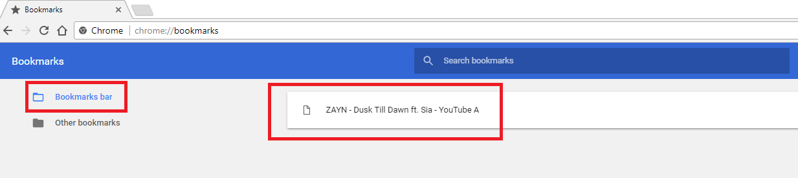

# My Youtube History

  <a href="https://github.com/Parth-Vader/YoutubeDataCollector">YoutubeDataCollector</a> is compaitable with the web-browsers like   

Searches :mag_right: for recent youtube videos opened and displays them in a list form. :bookmark_tabs:

## Installation

### Chrome

1. Visit `chrome://extensions`  :arrow_heading_down:

2. Enable Developer Mode. :heavy_check_mark:
3. Click on the "Load unpacked extension..."  :file_folder:

4. Select the directory in which this repo is cloned.  :open_file_folder:

5. YoutubeDataCollector is now installed on your browser.  :+1:

## How to Use?

Now that the extension is installed in your web browser. You can see the logo on the top-right of your browser. :arrow_upper_right:
 Click on the logo and then `Show`
 

It displays the recent youtube videos opened and displays them in a list form. :raised_hands:

Add any video as a bookmark to your Bookmarks Bar

 

**Found a :bug:  bug?** [Open an issue](https://github.com/Parth-Vader/YoutubeDataCollector/issues/new) with some [emojis](http://emoji.muan.co).

### Looking to contribute? :heart_eyes:

Check out the [Issues](https://github.com/Parth-Vader/YoutubeDataCollector/issues) tab.
